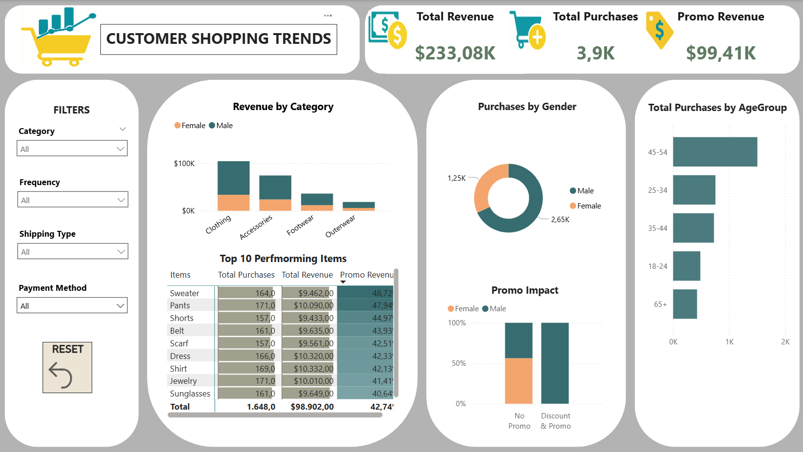
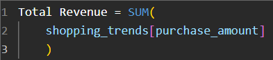
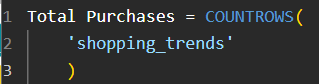
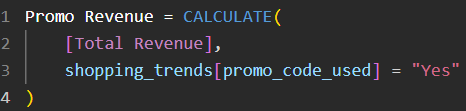
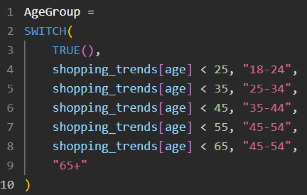

# 📊 Power BI Dashboard — *Customer Shopping Trends*

## 🖼️ Final Dashboard

---

## 🎯 Dashboard Objective

This **Power BI dashboard** provides a one-page executive summary of customer shopping behaviors, focusing on key sales metrics and promotional impact. It aims to deliver actionable insights in a clear and compact layout.

---

## 🧩 Key Components

### 🧾 KPI Cards
- **Total Revenue**: `$233,08K`
- **Total Purchases**: `3,90K`
- **Promo Revenue**: `$99,41K`

### 🔧 Filters Panel (Slicers)
- `Category`
- `Frequency`
- `Shipping Type`
- `Payment Method`

## 🔁 Reset Button (Bookmark)

- Implemented via **Action → Bookmark**
- Clears all selected filters with a single click

---

## 📈 Core Visualizations

| Chart Title                 | Type                    | Description |
|-----------------------------|--------------------------|-------------|
| **Revenue by Category**     | Stacked Column Chart     | Compares revenue per category by gender |
| **Top 10 Performing Items** | Matrix                   | Displays Total Purchases, Total Revenue, Promo Revenue % for top items |
| **Purchases by Gender**     | Donut Chart              | Distribution of purchases by Male and Female |
| **Promo Impact**            | 100% Stacked Column Chart| Shows purchase behavior with vs. without promotions by gender |
| **Total Purchases by Age**  | Clustered Bar Chart      | Total number of purchases segmented by age group |

---

## 📐 DAX Measures

> ℹ️ Below are some of DAX calculations used in the dashboard. Screenshots are provided instead of plain code for visual clarity.

### Totals
**Total Revenue**

**Total Purchases**

### Promo Metrics
**Promo Revenue**

### Calculated Columns
- **Age Group**: Groups customers into age brackets (e.g., 18-24, 25-34, etc.) for demographic analysis.

    

---

## 📌 Highlighted Insights

- **Revenue is highly driven by promotional sales**, with **over 42% of revenue** coming from items purchased with a promo code.
- **Top performing items** like *Sweater*, *Pants*, and *Shorts* account for the highest total revenue and promo usage.
- **Purchasing behavior is strongly skewed toward males**, who contribute to nearly **68% of all purchases**.
- **Promo Impact** chart reveals:
  - **Males are more likely to use promo codes** compared to females.
  - For **"No Promo" purchases**, the gender gap is narrower, indicating males tend to respond more to discounts.
- **Age group 45–54** leads in total purchases, showing this segment is highly engaged.

---

## 📌 Business Solutions

- **Target Male Shoppers**: Focus promos on male customers who dominate purchases and respond well to discounts.
- **Stock Bestsellers**: Ensure inventory for top 10 performing items; consider bundling them.
- **Boost Promo Efficiency**: Over 40% of purchases use promos — increase visibility of discounted products.
- **Age-Specific Offers**: Prioritize marketing for ages 45–54 who make the most purchases.
- **Promote Frequent Buyers**: Leverage frequency data to build loyalty or subscription programs.
- **Category Focus**: Clothing drives most revenue — invest in this category's promotion and upsells.

