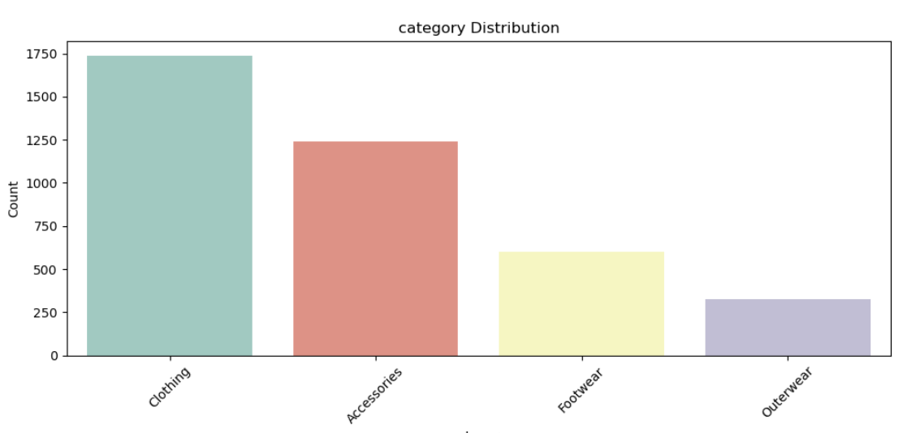
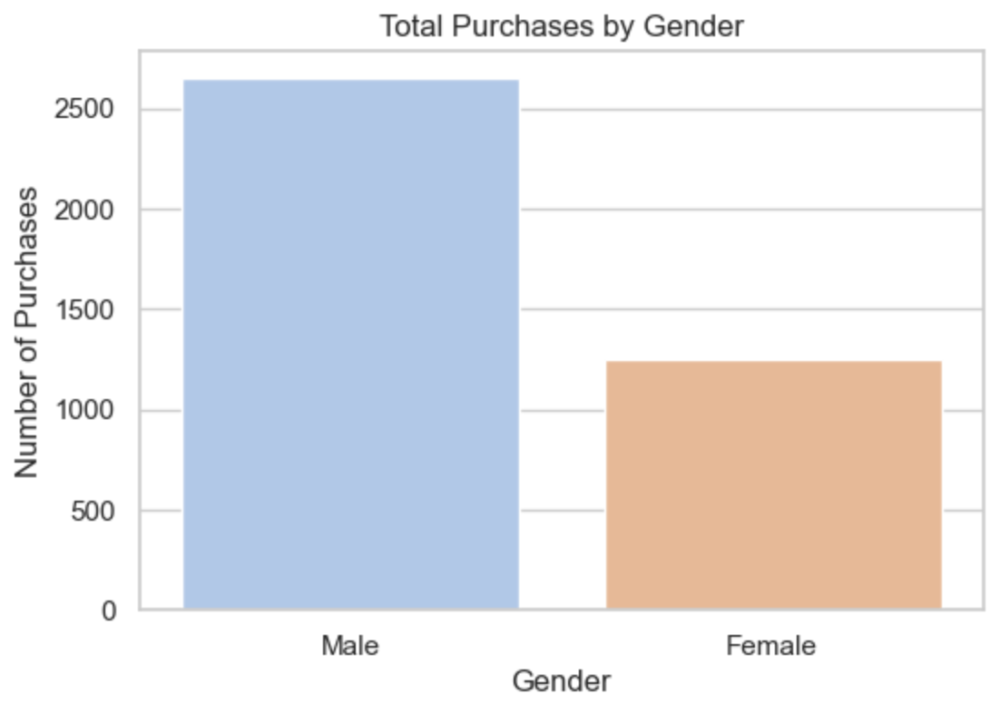
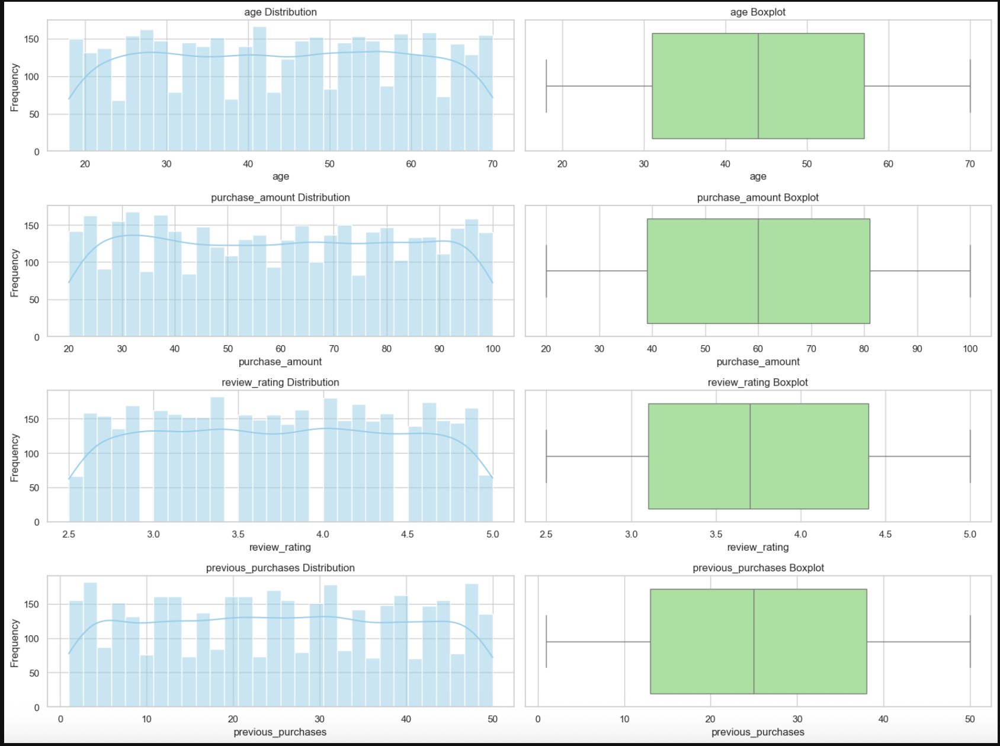
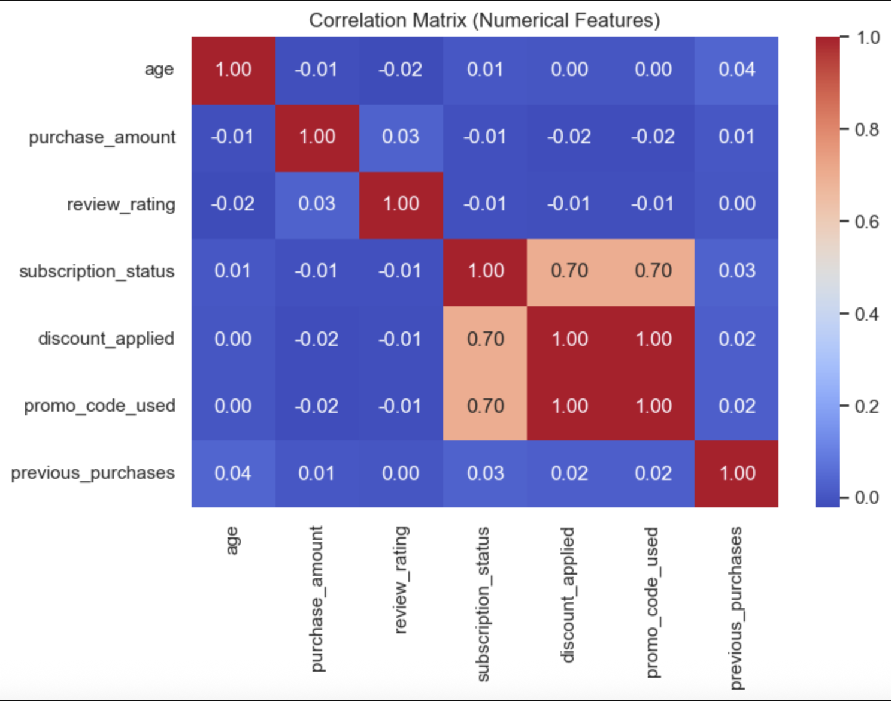

# 🛍️ Customer Shopping Trends - EDA with Python

This project performs **Exploratory Data Analysis (EDA)** on customer shopping behavior data to identify patterns and gain insights into purchasing trends. The dataset includes information such as product categories, customer demographics, payment methods, discounts, and reviews.

---

## 📁 Dataset Description

The dataset contains **3,900** records with features like:

- **Demographics:** `age`, `gender`, `location`
- **Shopping behavior:** `item_purchased`, `category`, `purchase_amount`, `review_rating`
- **Purchase patterns:** `discount_applied`, `promo_code_used`, `previous_purchases`, `payment_method`, `frequency_of_purchases`
- **Seasonal behavior:** Encoded columns for `season_Fall`, `season_Spring`, `season_Summer`, `season_Winter`

---

## 🔍 Project Goals

- Understand the distribution of purchases across different categories
- Analyze gender-based purchasing behavior
- Explore relationships between key numerical variables (e.g., purchase amount, review rating)
- Identify trends and correlations that could inform marketing or product strategies

---

## 📊 Key Visualizations

### 1. 📦 Category Distribution

Shows which product categories are the most popular.

**Insight:** Clothing dominates purchases, followed by Accessories and Footwear.

---

### 2. 👨‍🦱👩 Purchases by Gender

**Insight:** Males account for a significantly higher number of purchases than females.

---

### 3. 📈 Numerical Feature Distributions

- Age is fairly evenly spread across adult age ranges
- Purchase amount is well distributed, with minor outliers
- Review ratings center around neutral/positive values
- Previous purchases follow a relatively uniform pattern

---

### 4. 🔗 Correlation Matrix

**Insight:**  
- Strong correlation between `subscription_status`, `discount_applied`, and `promo_code_used`
- No major multicollinearity among most features — good for future ML modeling

---

## 📂 Files in This Repository

| File | Description |
|------|-------------|
| `shopping_EDA.csv` | Cleaned dataset from SQL for further visualization in Power BI |
| `shopping_EDA.ipynb` | Full Python notebook containing the EDA |
| `category_distr.png` | Plot showing distribution of product categories |
| `gender_purchases.png` | Plot showing purchase count by gender |
| `cor_heatmap.png` | Correlation matrix of numerical features |
| `num_col_distr.png` | Distribution and boxplots for numeric columns |

---

## 📌 Tools Used

- **Python Libraries:** `pandas`, `seaborn`, `matplotlib`, `scikit-learn`
- **SQL:** Used to load and preprocess the data
- **Power BI:** Next step for dashboard visualization

---

## ✅ Next Steps

- Import the cleaned dataset into Power BI
- Build interactive dashboards for further business insights
- Optionally apply clustering or classification models in a future iteration
