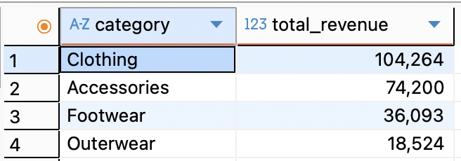

# 📁 SQL Analysis - Customer Shopping Trends

## 🎯 Purpose

This folder contains all SQL-related files used to analyze the **Customer Shopping Trends** dataset.  
The analysis aimed to derive valuable business insights related to customer behavior, product performance, and purchasing patterns by running SQL queries on structured transactional data.

---

## 📂 Folder Contents

```
sql/
├── scripts/               # Scripts for database, schema and queries
├── images/                # Query result screenshots for README visualizations
└── README.md              # This file
```

---

## 🔑 Key SQL Queries & Visual Results

### 1. 🧮 Total Purchases
```sql
SELECT COUNT(*) AS total_purchases
FROM shopping_trends;
```

---

### 2. 👤 Customers by Age
```sql
SELECT age, COUNT(DISTINCT customer_id) AS num_customers
FROM shopping_trends
GROUP BY age
ORDER BY age;
```


---

### 3. 👕 Top Purchased Items
```sql
SELECT item_purchased, COUNT(*) AS times_purchased
FROM shopping_trends
GROUP BY item_purchased
ORDER BY times_purchased DESC
LIMIT 10;
```


---

### 4. 💰 Total Revenue by Category
```sql
SELECT category, SUM(purchase_amount_usd) AS total_revenue
FROM shopping_trends
GROUP BY category
ORDER BY total_revenue DESC;
```


---

### 5. 🌱 Purchases by Season
```sql
SELECT season, COUNT(*) AS total_purchases
FROM shopping_trends
GROUP BY season
ORDER BY total_purchases DESC;
```


---

### 6. 🧾 Subscription vs Non-subscription Spending
```sql
SELECT subscription_status, COUNT(*) AS total,
       ROUND(AVG(purchase_amount_usd), 2) AS avg_spent
FROM shopping_trends
GROUP BY subscription_status;
```


---

### 7. 🔁 Customer Loyalty Segments
```sql
SELECT
  CASE
    WHEN previous_purchases >= 10 THEN 'High Loyalty'
    WHEN previous_purchases >= 5 THEN 'Mid Loyalty'
    ELSE 'Low Loyalty'
  END AS loyalty_segment,
  COUNT(*) AS customer_count
FROM shopping_trends
GROUP BY loyalty_segment;
```


---

## 📌 Next Steps

- Optimize for large datasets
- Connect to Power BI for dashboarding
- Optional: push to Azure SQL for cloud reporting
